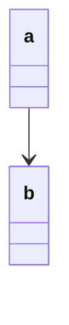

# Mermaid Arrow Reverser

chatGPTに作ってもらった
Markdown内のMermaid記法 `a --> b` を `b <-- a` に反転するVS Code拡張機能です。

## 使い方

1. MermaidコードブロックのあるMarkdownファイルを開く
2. 矢印のある行にカーソルを移動
3. `Ctrl + .`（Macは`Cmd + .`）を押すと、その行の矢印が反転

## 適用例

が以下のように変換されます：

## インストール方法

`extension.js`をvscodeで開いてF5を押すとテストできます

vscodeの拡張機能タブ→…→VSIXからのインストールから、vsixファイルを選択するとインストールできます
